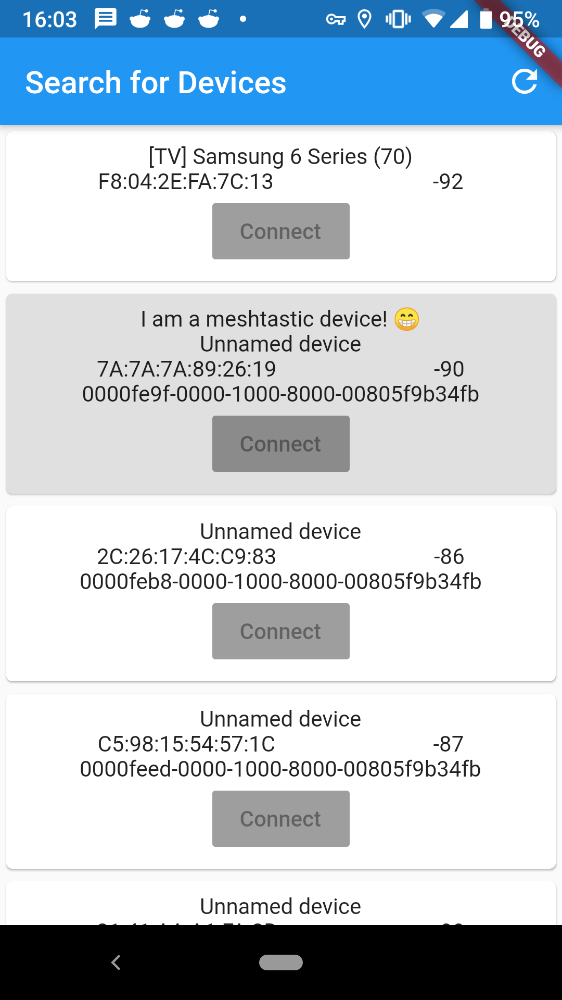

# meshtastic_nodedbread_flutter

This is a demo application for reading the NodeDB from a Meshtastic device using the flutter_blue library, which will allow operation on both iOS and Android devices. 

Currently I only have the Bluetooth search list written. I still need to write the actual connecting and interaction with the device. 

I do not have a Meshtastic node myself, so on the mock branch is where I've written an alternative version of the app that uses a fake implementation of the bluetooth library that will pretend a Meshtastic device is present. I still need to write the device logic of reading/writing from ToRadio/FromRadio and use the appropriate protobufs, so that will be happening soon.
